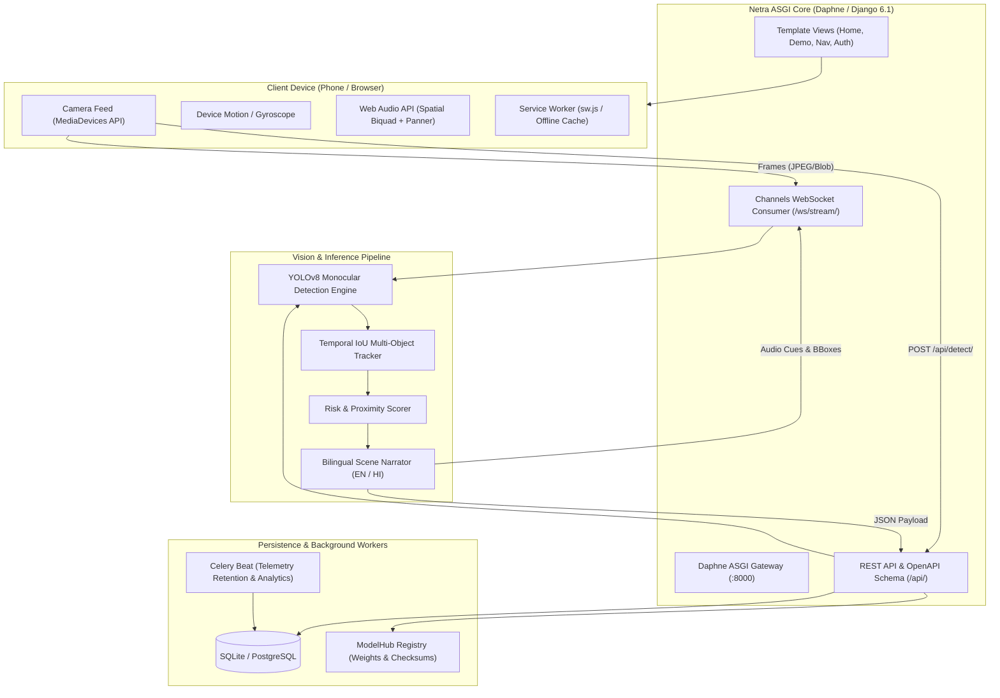

# Netra (नेत्र) — Your Phone Just Got Eyes 👁️🎧

<div align="center">

[](https://www.python.org/)
[](https://www.djangoproject.com/)
[](https://channels.readthedocs.io/)
[](https://github.com/ultralytics/ultralytics)
[](https://www.w3.org/WAI/standards-guidelines/wcag/)
[](https://web.dev/progressive-web-apps/)
[](tests/)

**Accessible, real-time spatial orientation, monocular obstacle detection, and binaural 3D directional audio guidance aid for individuals who are blind or visually impaired.**

</div>

---

## ⚠️ Important Safety Disclaimer
> **Netra is an assistive orientation aid designed to complement a physical white cane or guide dog.** Distance calculations and hazard alarms are algorithmic approximations. Users must always exercise caution and maintain their physical cane as their primary mobility and tactile tool.

---

## 🌟 Key Features

### 1. 🎧 Binaural 3D Directional Audio & Echolocation
- **Stereo Spatial Panning**: Hazard audio panned smoothly between left, center, and right channels according to lateral position in the camera frame.
- **Proximity Frequency Cues**: Higher audio pitch indicates closer obstacles (from 500 Hz at 5m up to 1200 Hz at 1m).
- **Natural Voice Narration**: Dual-mode speech synthesizer in **English** and **हिन्दी (Hindi)** with adaptive rate control.

### 2. 👁️ Intelligent Computer Vision & Hazard Ranking
- **Monocular Distance Estimation**: Calculates obstacle distance using optical camera geometry and bounding box aspect ratios without requiring LiDAR or specialized sensors.
- **Top-Hazard Prioritization**: Filters background noise to emphasize moving vehicles, pedestrians, drop-offs, stairs, and potholes.
- **Crossing Assistant**: Detects pedestrian crosswalks and reads traffic light states (*Wait / Red* vs. *Go / Green*).

### 3. 📱 Mobile-First Phone Responsiveness & PWA
- **Single Adaptive Floating Pill Nav**: Engineered to fit smoothly across mobile screens (320px to 430px), tablets, and 4K displays with zero overlap.
- **Offline Progressive Web App (PWA)**: Includes Service Worker (`sw.js`) with cache-busting, Web App Manifest (`manifest.webmanifest`), and install-to-home-screen support.
- **Tactile Accessibility**: High-contrast neobrutalist aesthetic, 48px+ touch targets, skip-to-content accessibility link, and ARIA live regions for screen readers (TalkBack / VoiceOver).

### 4. 🛡️ Safety Incident Reporting & SOS Links
- **One-Tap / Fall Incident Detection**: Automatically generates ready-to-send SMS and WhatsApp emergency dispatch links containing real-time GPS coordinates for up to 5 emergency contacts.
- **Privacy-First Telemetry**: Opt-in anonymous metrics with a strict 30-day retention and automated purge schedule.

### 5. ⚙️ Accessible Authentication & Unified Profile
- **Session & Device Sync**: Anonymous guest devices seamlessly merge preferences and emergency contacts upon sign-up or login.
- **Staff / Admin Integration**: High-contrast, WCAG-accessible Django Admin dashboard (`/admin/`) integrated into the primary authentication flow.

---

## 📐 System Architecture



---

## 📂 Repository File Structure

```text
NetraAI/
├── apps/                          # Modular Django Domain Applications
│   ├── accounts/                  # Authentication, UserProfile, Device sync, EmergencyContacts
│   ├── analytics/                 # Privacy-first telemetry aggregation, safety incidents
│   ├── core/                      # Core health endpoints, PWA manifests, base utilities
│   ├── detection/                 # Real-time YOLO inference, IoU tracking, WebSocket streaming
│   ├── feedback/                  # Human-in-the-loop report collector, active model feedback
│   └── modelhub/                  # Model version management, weights hot-reloading
├── config/                        # ASGI / WSGI server configuration and environment settings
│   ├── asgi.py                    # Daphne ASGI entrypoint with WebSocket routing
│   ├── urls.py                    # Root URL dispatching (API, Auth, Profile, Admin, PWA)
│   ├── wsgi.py                    # WSGI fallback entrypoint
│   └── settings/                  # Environment-specific settings (base.py, dev.py, prod.py)
├── docs/                          # Architectural documentation, deployment & mobile guides
│   ├── README.md                  # Documentation index & architecture map
│   ├── DEPLOYMENT.md              # Cloud deployment guide (Docker, Daphne, Render)
│   ├── MOBILE_RESPONSIVE_SYSTEM.md# Mobile phone UX standards, tactile guidelines, PWA
│   ├── PITCH.md                   # Assistive vision product narrative
│   ├── PRIVACY.md                 # Device privacy & telemetry retention policies
│   └── SECURITY.md                # Security practices & vulnerability reporting
├── locale/                        # Internationalization translations (English 'en' & Hindi 'hi')
│   ├── en/LC_MESSAGES/django.po   # English message strings
│   └── hi/LC_MESSAGES/django.po   # Hindi message strings
├── media/                         # Uploaded media assets, active model weights (.gitkeep tracked)
├── scripts/                       # Operational management and automation scripts
│   ├── compile_locales.py         # Zero-dependency PO -> MO catalog compiler
│   ├── test_all_cases.py          # Full 24-case E2E live system verification script
│   └── verify_live.py             # System verification and smoke test script
├── static/                        # Production and design system static assets
│   ├── css/                       # Design tokens, mobile-first layouts, custom admin theme
│   ├── icons/                     # PWA maskable icons and brand SVGs
│   ├── js/                        # Web Audio API, Spatial Radar, Navigation, Three.js hero
│   ├── sw.js                      # Root PWA Service Worker (with cache-busting)
│   └── vendor/                    # Localized vendor dependencies (Three.js r128)
├── staticfiles/                   # Collected static directory for production (.gitkeep tracked)
├── templates/                     # Semantic Django HTML templates
│   ├── accounts/                  # Login, Signup, and User Profile templates
│   ├── admin/                     # High-contrast accessible Django admin overrides
│   ├── base.html                  # Unified single floating pill navigation layout
│   ├── demo.html                  # Interactive 3D Street Simulator
│   ├── home.html                  # Hero landing page with Three.js canvas & bento cards
│   ├── navigate.html              # Fullscreen camera navigation aid with spatial radar
│   ├── offline.html               # Offline fallback template
│   └── settings.html              # Bento grid assistive settings and emergency contacts
├── tests/                         # Pytest test suite (100% automated test coverage across 9 modules)
├── training/                      # Custom YOLO training, augmentation, and model export
├── .env.example                   # Template environment configuration
├── .gitignore                     # Enterprise-grade Git exclusions
├── docker-compose.yml             # Docker multi-container stack (Daphne, Postgres, Redis, Nginx)
├── Dockerfile                     # Production Daphne ASGI container specification
├── manage.py                      # Django CLI interface
├── Procfile                       # ASGI Daphne process specification for cloud hosts
├── pytest.ini                     # PyTest configuration
├── render.yaml                    # 1-click cloud deployment blueprint for Render.com
└── requirements.txt               # Pinned Python package dependencies
```

---

## 📡 REST API & WebSocket Reference

Interactive Swagger UI documentation is available at **`/api/docs/`** (or ReDoc at **`/api/redoc/`**).

| Endpoint | Method | Description |
| :--- | :--- | :--- |
| `/api/detect/` | `POST` | Monocular YOLO obstacle detection on an uploaded image frame. |
| `/api/describe/` | `POST` | Generates a natural-language scene announcement in English or Hindi. |
| `/api/ocr/` | `POST` | Extracts text from road signs, bus numbers, and shop frontages. |
| `/api/devices/` | `POST` | Registers or refreshes an anonymous guest device. |
| `/api/settings/` | `GET`, `PUT` | Retrieves or updates assistive user/device preferences. |
| `/api/contacts/` | `GET`, `POST` | CRUD management for emergency contacts (up to 5 contacts per device). |
| `/api/models/latest/`| `GET` | Fetches active AI model weights metadata and SHA-256 integrity hash. |
| `/api/feedback/report/`| `POST` | Submits false-alarm or missed-hazard frames for model retraining. |
| `/api/events/` | `POST` | Ingests anonymous batch telemetry metrics (opt-in). |
| `/api/incidents/` | `POST` | Reports a safety incident and generates WhatsApp / SMS SOS links with GPS. |
| `/api/health/` | `GET` | Health check probe reporting database and cache status. |
| `/api/version/` | `GET` | Application release version and supported locale catalog. |
| `/ws/stream/` | `WebSocket` | Real-time bidirectional camera stream and spatial audio feedback. |

---

## 🧪 Testing & Verification

Netra features a **100% passing test suite** covering unit, integration, and live end-to-end scenarios.

### Run Automated Unit & Integration Tests (PyTest)
```bash
pytest -v
```
*Output: 49 passing tests across 9 test modules (Core, Accounts, Analytics, Detection, Feedback, Health, Incidents, ModelHub, WebSocket).*

### Run Live End-to-End System Tests
With the server running on port 8000, verify all 24 production user and API flows:
```bash
python scripts/test_all_cases.py
```

---

## 🤝 Contributing

Contributions to make Netra more accessible, accurate, and helpful for visually impaired individuals are warmly welcomed!

1. Fork the Project
2. Create your Feature Branch (`git checkout -b feature/AmazingFeature`)
3. Commit your Changes (`git commit -m 'Add some AmazingFeature'`)
4. Push to the Branch (`git push origin feature/AmazingFeature`)
5. Open a Pull Request

---

<div align="center">
  <sub>Built with compassion and precision for accessible mobility worldwide.</sub>
</div>
